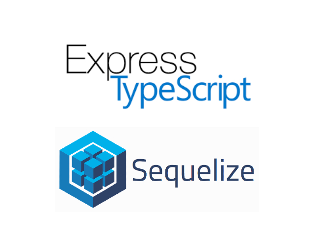

# express-sequelize-ts




## Description

A TypeScript-based boilerplate for creating a web application using the Express framework and the Sequelize ORM. \
Made with [Express](https://expressjs.com/en/4x/api.html), [TypeScript](https://www.typescriptlang.org/docs), [TypeStack](https://github.com/typestack), [ESLint](https://eslint.org/docs/latest), [Prettier](https://prettier.io/docs/en), [Jest](https://jestjs.io/docs/getting-started), and [Docker](https://docs.docker.com).

## Features

#### Developer experience

- 🚚 [Express](https://expressjs.com/en/4x/api.html) for handling HTTP requests and responses
- 💾 [Sequelize](https://github.com/sequelize/sequelize-typescript) ORM for interacting with a database
- 🟦 [TypeScript](https://www.typescriptlang.org/docs) for strong typing and better code organization
- 📚 [TypeStack](https://github.com/typestack) for building Decorator-based Express applications
  - [routing-controllers](https://github.com/typestack/routing-controllers) building routing controllers
  - [class-validator](https://github.com/typestack/class-validator) for data validation
  - [class-transformer](https://github.com/typestack/class-transformer) for data transformation
  - [typedi](https://github.com/typestack/typedi) for dependency injection
- 🛠 [Jest](https://jestjs.io/docs/getting-started) for unit and integration testing
- 🚧 [ESLint](https://eslint.org/docs/latest) for linting
- 🎨 [Prettier](https://prettier.io/docs/en) for code formatting
- 🐳 [Docker](https://docs.docker.com) for containerization

#### Back-end app features

- 🚫 JWT authentication for secure access to the API
- 🎢 Layered architecture. (Controller, Service(Repository), Model)
- ♻️ Data Transport Object (DTO) for data validation
- 📦 Dependency injection for better code organization
- 📝 Swagger for API documentation

## Requirements

- Node.js
- Yarn
- SQLite (or any other database supported by Sequelize)
- Docker (optional)

## Getting Started

Run the following commands to set environment variables and install dependencies:

#### set environment variables

```bash
## set environment variables
#### make .env.{NODE_ENV} file using .env.example file
#### EX) .env.development | .env.test
$ cp .env.example .env.development
```

#### install dependencies

```bash
## install dependencies
#### using yarn
$ yarn install

#### using Docker
$ yarn docker:build
```

then, you can run locally in development and test mode:

```bash
## run locally in development and test mode
#### using yarn
$ yarn dev | test:integration | test:unit:all | test:unit {path}

#### using Docker
$ yarn docker:dev | docker:test
```

call test API endpoints:

```json
// http://localhost:3000/api
// Content-Type: application/json
{
  "message": "Hello World"
}
```

## Deploy to production

you can deploy to production using yarn or Docker:

```bash
## using yarn
$ yarn build
$ yarn start

## using Docker
$ yarn docker:prod
```

## What's next?

- [x] ~~Add unit test~~
- [x] ~~Add integration test~~
- [x] ~~Add docker-compose~~
- [x] ~~Add swagger~~
- [ ] Write more specific documentation
- [ ] Develop a new feature

## License

This project is licensed under the MIT License - see the [LICENSE](https://github.com/beerjoa/express-sequelize-ts/blob/main/LICENSE.md) file for details.
